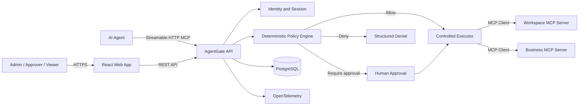

# AgentGate MCP

**A policy-enforcing MCP gateway for controlled AI-agent tool use.**

AgentGate sits between AI agents and downstream Model Context Protocol (MCP) servers. Instead of giving an agent direct access to every tool, AgentGate authenticates the caller, validates requested arguments, evaluates deterministic policies, pauses risky actions for human approval, executes approved requests, and records the complete decision and execution trail.

> **Status:** Product definition and architecture planning. Application implementation has not started.

## Why this project exists

MCP standardizes how AI applications discover and invoke tools, but production systems still need an application-level answer to questions such as:

- Which agent and user may invoke a tool?
- Are the requested arguments inside their authorized scope?
- Does a destructive or externally visible action require approval?
- Were the exact approved arguments executed?
- Was a retry safely deduplicated?
- Can a reviewer reconstruct the full decision and execution history?

AgentGate is a reusable enforcement point for those controls. It is not an agent framework and it does not use an LLM to make authorization decisions.

## MVP

The first release will demonstrate:

- agent and human-user authentication;
- downstream MCP server and tool registration;
- an upstream Streamable HTTP MCP endpoint;
- tool-call interception and JSON Schema validation;
- deterministic `Allow`, `Deny`, `RequireApproval`, and bounded `Transform` decisions;
- approvals bound to the exact tool schema and canonical argument hash;
- idempotent background execution;
- append-only, tamper-evident audit records;
- correlated execution traces;
- a React and TypeScript management application;
- deterministic protocol, security, reliability, and agent-behavior evaluations.

## Product boundary

AgentGate is an **MCP server upstream**, an **MCP client downstream**, and a **policy enforcement point** in the middle.

## Demonstration tools

| Tool | Risk | Expected behavior |
|---|---|---|
| `workspace.read_file` | Low read | Allowed only inside an approved sandbox path |
| `customers.search` | Sensitive read | Tenant-scoped; result size and PII fields may be restricted |
| `issues.create` | Medium write | Allowed for a sandbox repository or approval-gated elsewhere |
| `communications.send_email` | High external side effect | Always requires approval; uses a fake mailbox in the MVP |
| `workspace.delete_file` | High destructive action | Always requires approval and an expected file hash |

## Architecture decisions

- **Modular monolith**, not microservices.
- **.NET 10 and ASP.NET Core** for the API, MCP gateway, workers, and domain logic.
- **React, TypeScript, and Vite** for the management application.
- The React app uses normal REST endpoints; agents use the separate MCP endpoint.
- The production build is served by ASP.NET Core so the MVP remains one deployable application.
- Official **MCP C# SDK** for client and server behavior.
- **Streamable HTTP only** for the MVP.
- **PostgreSQL and EF Core** for durable state.
- PostgreSQL-backed execution leases instead of RabbitMQ, Kafka, or Redis.
- **OpenTelemetry** for operational traces and metrics.
- **xUnit, Testcontainers, Vitest, React Testing Library, Playwright, and GitHub Actions** for testing.
- Microsoft Agent Framework is used by the demo agent, not by the authorization core.

## Documentation

Start with the [documentation index](docs/README.md).

- [Product specification](docs/product-specification.md)
- [Architecture](docs/architecture.md)
- [MCP compatibility baseline](docs/mcp-compatibility.md)
- [MVP scope](docs/mvp-scope.md)
- [Demonstration workflows](docs/demonstration-workflows.md)
- [Policy design](docs/policy-design.md)
- [Domain model](docs/domain-model.md)
- [Security and threat model](docs/threat-model.md)
- [Reliability model](docs/reliability-model.md)
- [Evaluation and testing](docs/evaluation-and-testing.md)
- [Observability and performance](docs/observability-and-performance.md)
- [Implementation roadmap](docs/implementation-roadmap.md)
- [Demo plan](docs/demo-plan.md)
- [Architecture decision records](docs/adr/README.md)

## Explicit MVP exclusions

The first release will not include:

- multi-agent orchestration;
- RAG, embeddings, or vector search;
- AI-generated authorization decisions;
- a general-purpose policy programming language;
- arbitrary downstream stdio processes;
- a message broker;
- microservices or Kubernetes;
- real email delivery;
- billing or full SaaS tenant administration;
- a separate frontend deployment;
- claims of complete enterprise security or complete MCP OAuth conformance.

## Success criteria

The MVP is complete when a seeded agent can:

1. perform a safe read through AgentGate;
2. receive a clear denial for an unauthorized cross-tenant action;
3. submit a destructive action for approval;
4. execute the exact approved arguments once;
5. fail when attempting argument tampering, replay, or direct downstream bypass;
6. display a complete trace and verifiable audit timeline in the React UI;
7. run a deterministic evaluation suite proving the expected behavior.

## Research baseline

The design is based on the current official MCP specification, the official C# SDK, and Microsoft Agent Framework documentation:

- [MCP specification 2025-11-25](https://modelcontextprotocol.io/specification/2025-11-25)
- [MCP tools specification](https://modelcontextprotocol.io/specification/2025-11-25/server/tools)
- [MCP transports specification](https://modelcontextprotocol.io/specification/2025-11-25/basic/transports)
- [Official MCP C# SDK](https://github.com/modelcontextprotocol/csharp-sdk)
- [Microsoft Agent Framework MCP tools](https://learn.microsoft.com/en-us/agent-framework/agents/tools/local-mcp-tools)
- [Microsoft Agent Framework observability](https://learn.microsoft.com/en-us/agent-framework/agents/observability)

## License

This project is licensed under the MIT License.