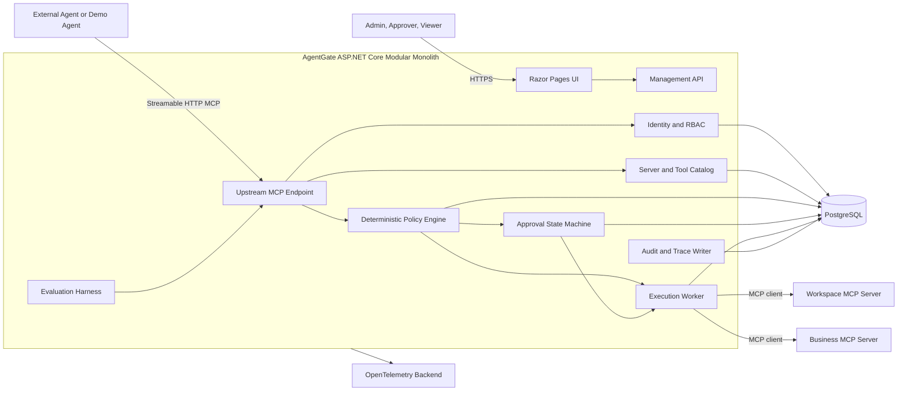
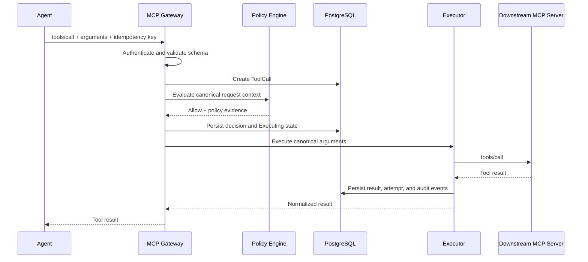
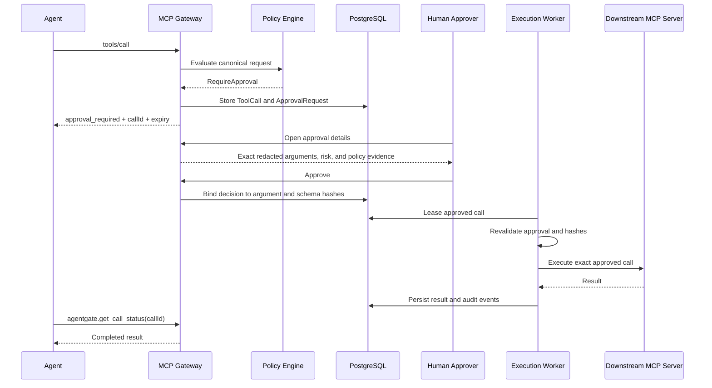
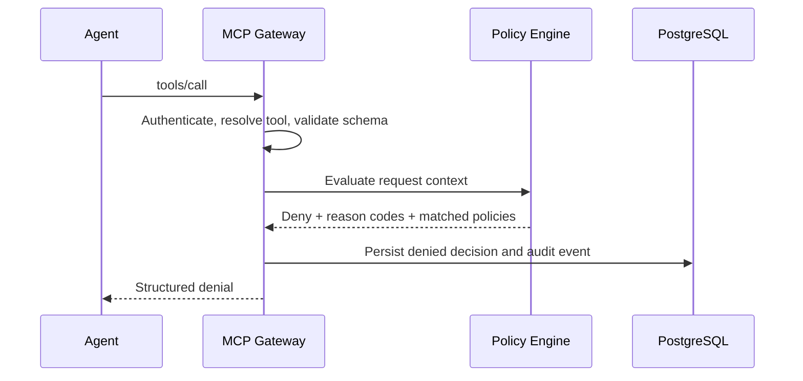

# Architecture

## Decision

AgentGate will be implemented as a **modular monolith** for the MVP.

A single ASP.NET Core deployment will contain explicit modules for identity, MCP gateway behavior, server and tool registration, policy evaluation, approvals, execution, audit, evaluations, and the management UI. PostgreSQL will provide transactional persistence and work leasing.

Microservices are rejected for the MVP because they would introduce distributed transactions, message delivery, deployment overhead, and more failure modes before the core product behavior is proven.

## Major components

- **Upstream MCP endpoint** — accepts Streamable HTTP MCP connections from agents.
- **Identity and session module** — authenticates machine principals and resolves acting-user and tenant context.
- **Tool catalog** — registers downstream MCP servers, discovers tools, versions schemas, and controls publication.
- **Policy engine** — evaluates deterministic typed policies and produces reasoned decisions.
- **Approval workflow** — persists approval requests, decisions, expirations, and argument bindings.
- **Execution worker** — leases approved work, invokes downstream MCP tools, and persists results.
- **Audit and trace module** — appends domain audit events and correlates OpenTelemetry traces.
- **Evaluation module** — executes deterministic security and agent-behavior scenarios.
- **Management UI** — Razor Pages for registration, approvals, traces, policies, and evaluation results.

## Component diagram



## MCP boundary

### Upstream

AgentGate presents one Streamable HTTP MCP endpoint. Agents initialize a session and receive only the virtual tools published for their authenticated identity and tenant.

### Downstream

AgentGate uses the official MCP C# SDK as a client to registered Streamable HTTP MCP servers. Each downstream server is represented by a separate logical client connection and credential reference.

### Tool discovery

1. An administrator registers a server endpoint and alias.
2. AgentGate initializes an MCP client connection.
3. AgentGate retrieves the tool catalog.
4. Each discovered tool is stored with its input schema, output schema, description, server identity, and schema hash.
5. New or changed tools enter `PendingReview` or `DriftDetected`.
6. A reviewer assigns a local risk level, operation type, sensitivity tags, and published name.
7. Only approved tool versions can be exposed upstream.

## Allowed-call sequence



## Approval-required sequence



## Denied-call sequence



## Proposed solution structure

```text
AgentGate.sln

src/
  AgentGate.App/              # ASP.NET host, MCP endpoint, API, UI, workers
  AgentGate.Core/             # domain entities, state machines, use cases
  AgentGate.Infrastructure/   # EF Core, PostgreSQL, auth, encryption, OTel
  AgentGate.Mcp/              # upstream and downstream MCP adapters
  AgentGate.Policy/           # policy schema, validation, evaluator

samples/
  AgentGate.DemoAgent/
  AgentGate.WorkspaceMcp/
  AgentGate.BusinessMcp/

tests/
  AgentGate.UnitTests/
  AgentGate.IntegrationTests/
  AgentGate.ProtocolTests/
  AgentGate.SecurityTests/
  AgentGate.EvaluationTests/
  AgentGate.PlaywrightTests/
  AgentGate.LoadTests/
```

The solution should not create one project per entity or per use case. Module boundaries are valuable only when they clarify ownership and dependencies.

## Future split points

The first candidate for a separate deployment is the execution worker, but only when one of these is measured or required:

- tool execution needs a separate network or security boundary;
- long-running calls interfere with API responsiveness;
- multiple worker replicas are necessary;
- execution needs independent scaling;
- tool credentials must be isolated from the public-facing host.

The policy engine should remain an in-process deterministic component until multiple products need a shared policy service.