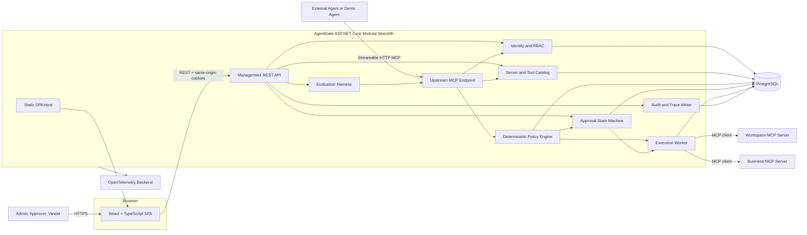
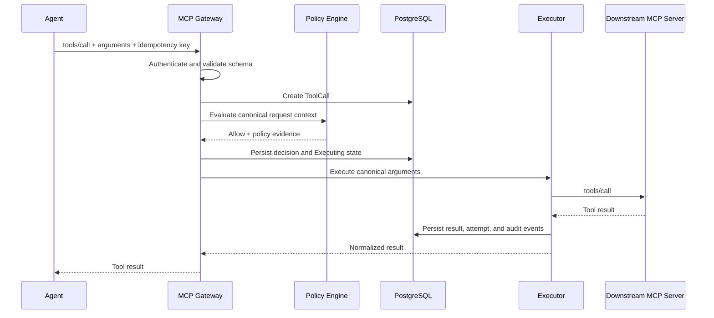
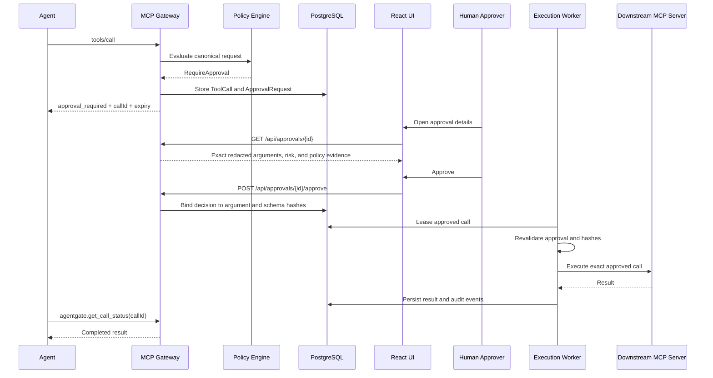
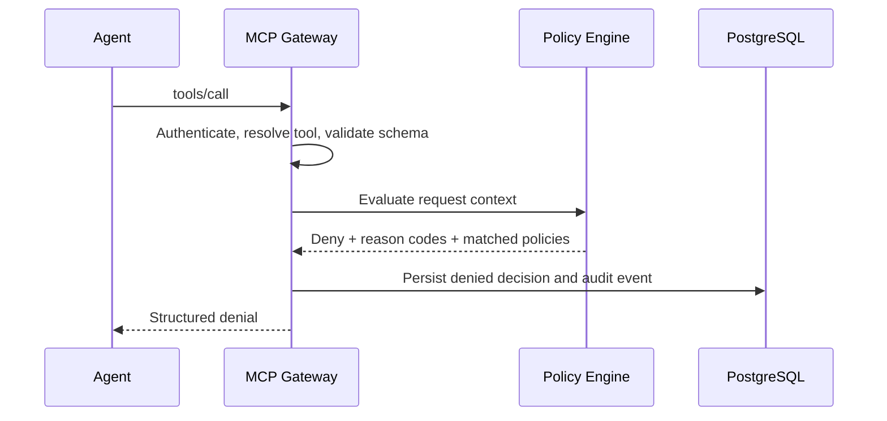

# Architecture

## Decision

AgentGate will be implemented as a **modular monolith with a separate React source application and one production deployment**.

ASP.NET Core will contain the MCP gateway, REST management API, identity, server and tool registration, policy evaluation, approvals, execution, audit, evaluations, and background workers. A React and TypeScript single-page application will provide the human management experience. PostgreSQL will provide transactional persistence and work leasing.

During local development, Vite runs the frontend and proxies API requests to ASP.NET Core. In production, the React build is copied into the ASP.NET Core static-file output and served from the same origin. This keeps the browser UI modern without creating a second independently deployed service.

Microservices and independently deployed frontend infrastructure are rejected for the MVP because they would introduce distributed transactions, deployment coordination, CORS, cross-site authentication, and more failure modes before the core product behavior is proven.

## Major components

- **Upstream MCP endpoint** — accepts Streamable HTTP MCP connections from agents.
- **Management REST API** — exposes human-facing administration, approval, trace, policy, and evaluation operations.
- **React management application** — TypeScript SPA for registration, approvals, traces, policies, and evaluation results.
- **Identity and session module** — authenticates human and machine principals and resolves acting-user and tenant context.
- **Tool catalog** — registers downstream MCP servers, discovers tools, versions schemas, and controls publication.
- **Policy engine** — evaluates deterministic typed policies and produces reasoned decisions.
- **Approval workflow** — persists approval requests, decisions, expirations, and argument bindings.
- **Execution worker** — leases approved work, invokes downstream MCP tools, and persists results.
- **Audit and trace module** — appends domain audit events and correlates OpenTelemetry traces.
- **Evaluation module** — executes deterministic security and agent-behavior scenarios.

## Component diagram



## Frontend architecture

### Stack

- React
- TypeScript
- Vite
- React Router for browser routing
- TanStack Query for server-state fetching, caching, and mutation handling
- React Hook Form plus schema validation for forms
- Vitest and React Testing Library for component tests
- Playwright for browser-level workflows

Exact JavaScript package versions are pinned when Issue #2 creates the lockfile.

### API boundary

The browser uses ordinary REST endpoints under `/api`. It does not call the MCP endpoint.

Initial API groups:

```text
/api/auth
/api/overview
/api/agents
/api/mcp-servers
/api/tools
/api/policies
/api/approvals
/api/tool-calls
/api/evaluations
```

The REST API returns explicit DTOs. React never consumes EF Core entities directly.

### Authentication

Human users authenticate with ASP.NET Core Identity and secure same-origin cookies.

Development flow:

- Vite proxies `/api` and authentication routes to ASP.NET Core.
- Browser credentials are included with requests.
- State-changing requests include ASP.NET Core antiforgery protection.

Production flow:

- ASP.NET Core serves the React build and REST API from one origin.
- No CORS configuration is needed for the default deployment.
- The SPA fallback route must not intercept `/api`, `/mcp`, health, metrics, or static-asset routes.

The frontend never stores agent API keys, session cookies, or downstream credentials in local storage.

### UI state rules

- TanStack Query owns remote server state.
- Local React state is limited to temporary view state.
- Approval actions invalidate the affected approval queue and ToolCall queries.
- Authorization is enforced by the backend; hiding a button in React is not a security control.
- Sensitive values are redacted by the API before they reach the browser.

## MCP boundary

### Upstream

AgentGate presents one Streamable HTTP MCP endpoint. Agents initialize a session and receive only the virtual tools published for their authenticated identity and tenant.

### Downstream

AgentGate uses the official MCP C# SDK as a client to registered Streamable HTTP MCP servers. Each downstream server is represented by a separate logical client connection and credential reference.

### Tool discovery

1. An administrator registers a server endpoint and alias through the REST API and React UI.
2. AgentGate initializes an MCP client connection.
3. AgentGate retrieves the tool catalog.
4. Each discovered tool is stored with its input schema, output schema, description, server identity, and schema hash.
5. New or changed tools enter `PendingReview` or `DriftDetected`.
6. A reviewer assigns a local risk level, operation type, sensitivity tags, and published name.
7. Only approved tool versions can be exposed upstream.

## Allowed-call sequence



## Approval-required sequence



## Denied-call sequence



## Proposed repository structure

```text
AgentGate.sln

src/
  AgentGate.App/              # ASP.NET host, REST API, MCP endpoint, workers
  AgentGate.Core/             # domain entities, state machines, use cases
  AgentGate.Infrastructure/   # EF Core, PostgreSQL, auth, encryption, OTel
  AgentGate.Mcp/              # upstream and downstream MCP adapters
  AgentGate.Policy/           # policy schema, validation, evaluator
  AgentGate.Web/              # React + TypeScript + Vite SPA

samples/
  AgentGate.DemoAgent/
  AgentGate.WorkspaceMcp/
  AgentGate.BusinessMcp/

tests/
  AgentGate.UnitTests/
  AgentGate.IntegrationTests/
  AgentGate.ProtocolTests/
  AgentGate.SecurityTests/
  AgentGate.EvaluationTests/
  AgentGate.LoadTests/
```

Frontend tests live inside `src/AgentGate.Web`:

```text
src/AgentGate.Web/
  src/
  tests/
  package.json
  package-lock.json
  vite.config.ts
```

Playwright remains a repository-level end-to-end suite because it exercises the built frontend and backend together.

The solution should not create one .NET project per entity or use case. Module boundaries are valuable only when they clarify ownership and dependencies.

## Production build

1. `npm ci` and the frontend test suite run.
2. Vite builds static assets.
3. The assets are copied to the ASP.NET Core host's static output.
4. The .NET application is published as one deployable artifact.
5. ASP.NET Core maps API and MCP routes before the SPA fallback.

## Future split points

The first candidate for a separate deployment is the execution worker, but only when one of these is measured or required:

- tool execution needs a separate network or security boundary;
- long-running calls interfere with API responsiveness;
- multiple worker replicas are necessary;
- execution needs independent scaling;
- tool credentials must be isolated from the public-facing host.

The React app may be deployed separately later only if independent release cadence, CDN hosting, or organizational ownership becomes a real requirement.

The policy engine should remain an in-process deterministic component until multiple products need a shared policy service.