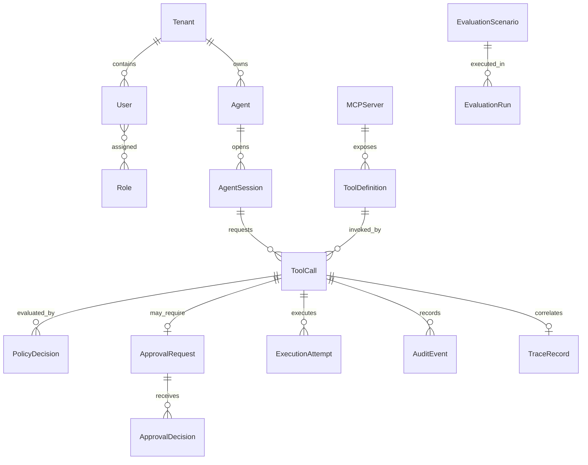
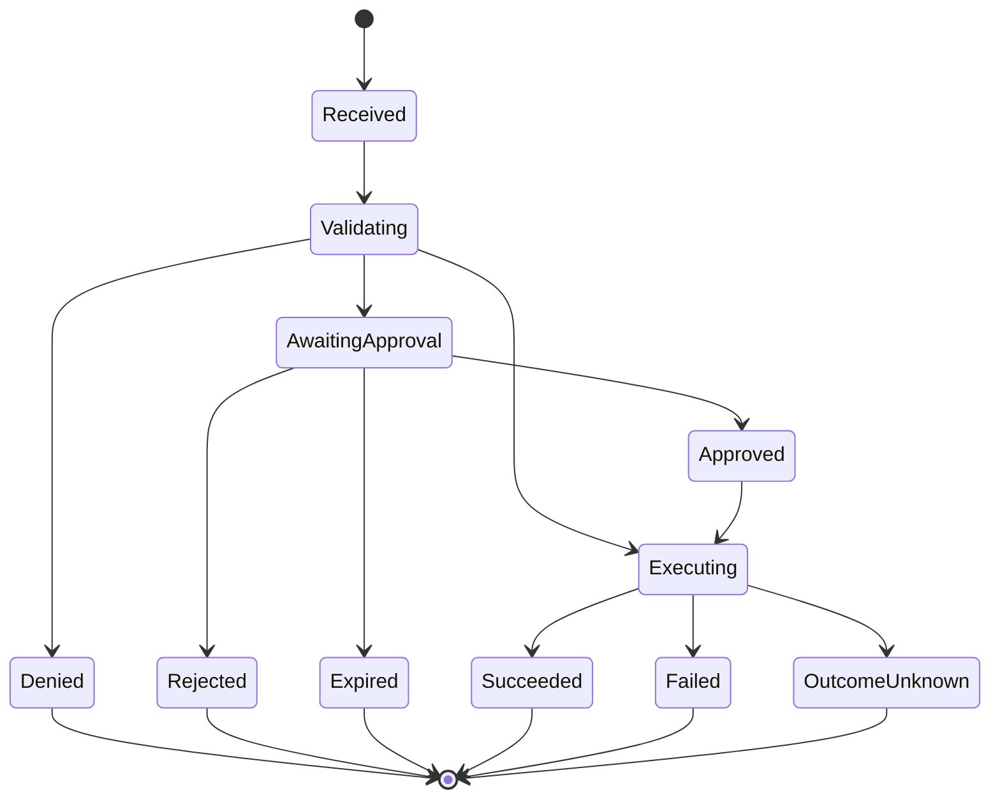

# Domain and Data Model

## Core relationships

## Tenant

**Purpose:** Isolation boundary used even though the MVP is not a SaaS product.

Important fields:

- `Id`
- `Name`
- `Status`
- `CreatedAt`

Relationships: users, agents, policies, calls, approvals, and audit events.

Retention: long-lived configuration.

## User

**Purpose:** Human operator using the management UI.

Important fields:

- `Id`
- `TenantId`
- `Email`
- `DisplayName`
- `Status`
- local or external identity reference

States: `Active`, `Disabled`.

Sensitive data: email address and authentication references.

## Role

MVP roles:

- `Administrator`
- `PolicyAuthor`
- `Approver`
- `Viewer`

A user may hold multiple roles. Management authorization is separate from tool-call policy evaluation.

## Agent

**Purpose:** Machine principal making MCP requests.

Important fields:

- `Id`
- `TenantId`
- `Name`
- `KeyPrefix`
- `CredentialHash`
- `Status`
- `AllowedUserDelegationMode`
- `CreatedAt`
- `LastSeenAt`

States: `Active`, `Suspended`, `Revoked`.

The original API key is displayed once and never stored.

## AgentSession

**Purpose:** Correlates one MCP connection and the activity performed through it.

Important fields:

- `Id`
- `AgentId`
- `ActingUserId`
- `McpSessionId`
- `StartedAt`
- `LastActivityAt`
- `EndedAt`
- `ClientInfo`
- `ProtocolVersion`
- `SourceAddressHash`

States: `Active`, `Closed`, `Expired`.

A session is bound to the authenticated agent. A request field cannot replace that identity.

## MCPServer

**Purpose:** Registered downstream MCP server.

Important fields:

- `Id`
- `TenantId`
- `Alias`
- `TransportType`
- `Endpoint`
- `CredentialReference`
- `TrustStatus`
- `HealthStatus`
- `LastDiscoveredAt`

States: `PendingValidation`, `Active`, `Unhealthy`, `Disabled`.

Credentials are referenced through a secret-provider abstraction and are not stored in the endpoint field.

## ToolDefinition

**Purpose:** Reviewed, versioned snapshot of a downstream MCP tool.

Important fields:

- `Id`
- `MCPServerId`
- `OriginalName`
- `PublishedName`
- `Description`
- `InputSchema`
- `OutputSchema`
- `SchemaHash`
- `RiskLevel`
- `OperationType`
- `SensitivityTags`
- `ReviewStatus`
- `Version`
- `Enabled`

States: `PendingReview`, `Approved`, `DriftDetected`, `Disabled`.

A changed schema creates a new version or moves the tool to `DriftDetected`. It never silently replaces an approved version.

## ToolCall

**Purpose:** Authoritative lifecycle record for one logical requested action.

Important fields:

- `Id`
- `TenantId`
- `AgentSessionId`
- `ToolDefinitionId`
- `ClientRequestId`
- `IdempotencyKey`
- `OriginalArgumentsEncrypted`
- `CanonicalArgumentsEncrypted`
- `OriginalArgumentsHash`
- `CanonicalArgumentsHash`
- `Status`
- `ReceivedAt`
- `CompletedAt`
- `TraceId`

State machine:

Invalid transitions are rejected in domain code and covered by unit tests.

## Policy

**Purpose:** Versioned deterministic authorization rule.

Important fields:

- `Id`
- `TenantId`
- `Name`
- `Version`
- `Priority`
- `Effect`
- `ConditionsJson`
- `TransformationsJson`
- `ReasonCode`
- `Status`
- `ValidFrom`
- `ValidUntil`
- `CreatedBy`

States: `Draft`, `Active`, `Superseded`, `Disabled`.

An active version is immutable.

## PolicyDecision

**Purpose:** Immutable evidence of one evaluator result.

Important fields:

- `Id`
- `ToolCallId`
- `Outcome`
- `MatchedPolicyVersions`
- `ReasonCodes`
- `InputFactsSnapshot`
- `AppliedTransformations`
- `EvaluatorVersion`
- `DurationMs`
- `CreatedAt`

The fact snapshot excludes secrets and unnecessary raw content.

## ApprovalRequest

**Purpose:** Durable request for a human decision.

Important fields:

- `Id`
- `ToolCallId`
- `Status`
- `RiskSummary`
- `CanonicalArgumentsHash`
- `ToolSchemaHash`
- `PolicyDecisionId`
- `RequiredRole`
- `ExpiresAt`

States: `Pending`, `Approved`, `Rejected`, `Expired`, `Cancelled`.

## ApprovalDecision

**Purpose:** Immutable human action.

Important fields:

- `Id`
- `ApprovalRequestId`
- `ApproverUserId`
- `Decision`
- `Comment`
- `ArgumentsHashSeen`
- `DecidedAt`

A uniqueness constraint prevents more than one final decision for the same request.

## ExecutionAttempt

**Purpose:** Separates a logical call from one or more delivery attempts.

Important fields:

- `Id`
- `ToolCallId`
- `AttemptNumber`
- `LeaseOwner`
- `LeaseExpiresAt`
- `StartedAt`
- `EndedAt`
- `DownstreamRequestId`
- `Outcome`
- `ErrorCategory`
- `ResultHash`

States: `Leased`, `Running`, `Succeeded`, `Failed`, `TimedOut`, `OutcomeUnknown`.

## ExecutionResult

**Purpose:** Normalized final downstream result.

Important fields:

- `ToolCallId`
- `StructuredResultEncrypted`
- `RedactedResult`
- `ResultHash`
- `IsError`
- `ExternalOperationId`
- `CreatedAt`

Large outputs are rejected, truncated, or deferred to later object-storage support.

## AuditEvent

**Purpose:** Append-only security and business evidence.

Important fields:

- `Id`
- `TenantId`
- `ToolCallId`
- `EventType`
- `ActorType`
- `ActorId`
- `Timestamp`
- `RedactedPayload`
- `PayloadHash`
- `PreviousEventHash`
- `EventHash`

The application database role is denied update and delete access to audit rows. A PostgreSQL trigger enforces append-only behavior.

## TraceRecord

**Purpose:** Links the domain call to distributed tracing.

Important fields:

- `ToolCallId`
- `TraceId`
- `RootSpanId`
- `StartTime`
- `EndTime`
- `Outcome`

AgentGate does not duplicate every OpenTelemetry span into relational storage.

## EvaluationScenario

**Purpose:** Versioned expected behavior for a deterministic test world.

Important fields:

- `Id`
- `Name`
- `Category`
- `FixtureVersion`
- `Input`
- `ExpectedDecision`
- `ExpectedExecutionCount`
- `RequiredAuditEvents`
- `Tags`

## EvaluationRun

**Purpose:** Result of running scenarios against a specific build.

Important fields:

- `Id`
- `CommitSha`
- `StartedAt`
- `CompletedAt`
- `Environment`
- `Passed`
- `Failed`
- `Metrics`
- `ArtifactLocation`

## Sensitive-data handling

- Agent credentials are stored only as secure hashes.
- Downstream credentials are stored outside ordinary entity columns.
- Raw arguments and results are encrypted at the application layer.
- The UI and logs use redacted projections.
- Canonical argument hashes support approval verification without exposing plaintext.
- Credentials, email bodies, file contents, and customer records are excluded from normal logs.
- Argument and output sizes are bounded.

Recommended initial retention settings:

- encrypted raw arguments/results: 30 days;
- redacted call metadata: 180 days;
- audit hashes and decision metadata: retained for the life of the demo database;
- local telemetry: 7 days.

These are project defaults, not legal or regulatory claims.