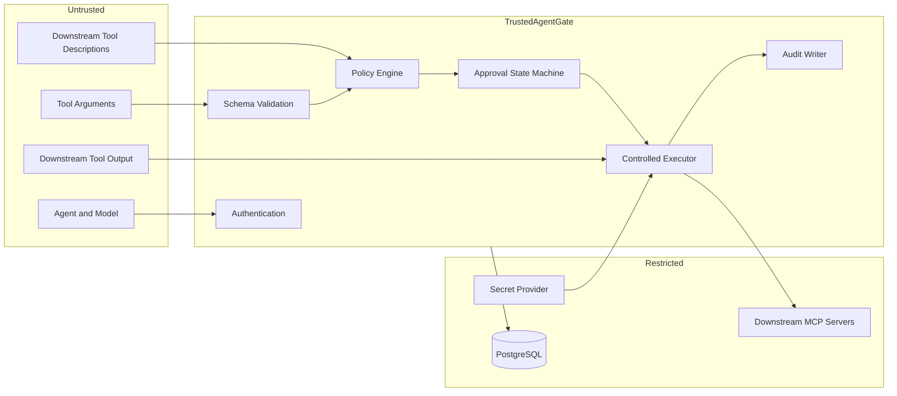

# Security and Threat Model

AgentGate reduces risk around agent tool use, but it cannot make an agent or downstream tool completely safe. The threat model focuses on realistic failures at the protocol, identity, policy, approval, execution, data, and deployment boundaries.

## Security goals

- Every tool call is tied to an authenticated agent and tenant.
- Downstream tools are never invoked before validation and policy evaluation.
- High-risk actions require a valid approval bound to exact arguments.
- Duplicate submissions do not create duplicate logical side effects.
- Cross-tenant access is denied.
- Tool schema changes cannot silently bypass review.
- Sensitive arguments and results are not exposed in normal logs.
- Important decisions and state changes are reconstructable and tamper-evident.
- The agent cannot directly reach or authenticate to downstream MCP servers in the demo environment.

## Threats, mitigations, and tests

| Threat | Attack scenario | Likelihood | Impact | Mitigation | Verification |
|---|---|---:|---:|---|---|
| Prompt injection | Repository content instructs the agent to delete files or exfiltrate data | High | High | Deterministic policy outside the model; least privilege; approval gates | Seed injected content and verify unsafe calls are denied or gated |
| Forged agent identity | Caller supplies another agent ID in request metadata | Medium | High | Identity comes only from validated credentials | Send mismatched metadata and assert authenticated principal wins |
| Authorization bypass | Caller invokes an internal execution route directly | Medium | Critical | No public direct-execution endpoint; authorization on every route | Route-level security tests |
| Argument tampering | Arguments change after approval | Medium | Critical | Canonical argument hash and tool schema hash bound to approval | Approve one payload, alter one field, assert zero execution |
| Replay | A valid request is submitted repeatedly | High | High | Database uniqueness over tenant, agent, and idempotency key | Submit concurrently and assert one logical execution |
| Approval bypass | ToolCall state is changed to Approved without a decision | Low | Critical | Domain transition guards, DB constraints, worker validation | Seed invalid state and assert worker refuses |
| Confused deputy | Agent abuses AgentGate downstream credentials | Medium | High | Credentials scoped by tenant/server; no caller token passthrough | Attempt cross-server and cross-tenant credential use |
| Secret leakage | Credentials or sensitive arguments appear in logs | Medium | High | Header allowlist, structured redaction, encrypted raw payloads | Capture logs and scan for seeded secrets |
| Excessive permissions | Agent receives all registered tools | High | High | Per-agent tool publication and default deny | Compare catalogs for agents with different grants |
| Compromised MCP server | Downstream server lies about behavior or returns malicious content | Medium | High | Local risk metadata, schema pinning, output limits, network restrictions | Change schema and verify `DriftDetected` disables publication |
| Poisoned tool description | Tool description manipulates the model or reviewer | Medium | Medium | Treat descriptions as untrusted; maintain local classifications | Seed malicious description and verify it cannot alter policy |
| Audit tampering | Operator updates or deletes evidence | Low | High | Append-only DB role, trigger, chained hashes, verification job | Modify copied data and verify chain failure |
| Cross-tenant access | Tenant A requests Tenant B data | Medium | Critical | Tenant in keys and policy context; explicit checks and query filters | Two-tenant integration suite |
| Session hijacking | Stolen session identifier is reused by another agent | Medium | High | Bind session to authenticated agent; rotate and expire identifiers | Reuse session with another API key |
| Denial of service | Large requests, outputs, or pending approvals exhaust resources | High | Medium | Size limits, rate limits, bounded concurrency, timeouts | Oversized-input tests and load tests |
| Gateway bypass | Agent calls downstream server directly | High if exposed | Critical | Private network and gateway-only credentials | Attempt direct access from agent container |
| Malformed output | Downstream returns invalid or oversized data | Medium | Medium | Output validation, size limits, failure state | Fault server returns malformed responses |
| SSRF | Administrator registers a metadata, loopback, or internal endpoint | Medium | High | Endpoint validation, allowlists, blocked address ranges outside dev mode | Register prohibited URLs and assert rejection |
| Token passthrough | Caller token is forwarded to a downstream service not intended to receive it | Medium | High | Use AgentGate-managed downstream credentials; explicit header allowlist | Inspect downstream request headers |
| Tool-name collision | Two servers expose identically named tools | High | Medium | Stable server-qualified published names | Register collisions and assert deterministic aliases |
| Schema drift | Server changes required arguments after review | Medium | High | Persist schema hash and disable changed versions | Refresh changed server and assert tool is unavailable |
| Approval fatigue | Approver blindly accepts frequent requests | Medium | High | Clear risk facts, no bulk approval, expiry, rate limits | UI test and approval-volume metrics |
| Output injection | Tool output attempts to manipulate later agent behavior | High | Medium | Preserve provenance and sensitivity labels; do not treat output as authority | Feed malicious output and evaluate subsequent calls independently |

## Trust boundaries

## Deployment requirements for the demo

- The agent container must not receive downstream MCP credentials.
- Downstream servers must be reachable only from the AgentGate network segment or require a gateway-only credential.
- Management endpoints must not be exposed without authentication.
- Development secrets must use user secrets or environment variables, never committed files.
- PostgreSQL application credentials should not have update/delete permission on audit rows.
- The fake mailbox, issue tracker, and sandbox filesystem must be resettable.

## What AgentGate cannot guarantee

AgentGate cannot guarantee:

- that an agent does not have another ungoverned tool path;
- that a downstream server is honest;
- that a human approves the correct action;
- that a privileged database or host administrator cannot compromise the system;
- that an ambiguous network failure means a side effect did not occur;
- that authorized disclosure is safe after data leaves the gateway;
- that prompt injection has been solved;
- that the MVP meets any specific compliance certification;
- that API-key authentication is sufficient for a public enterprise deployment.

## Security acceptance criteria

Before MVP release:

- unauthorized-action prevention is 100% across the deterministic labeled suite;
- approval-bypass rate is 0%;
- duplicate-execution rate is 0% in concurrency tests;
- no seeded secret appears in captured logs;
- cross-tenant test coverage includes every tenant-scoped entity and query;
- direct downstream access fails from the agent environment;
- audit-chain tampering is detected;
- changed tool schemas cannot be invoked until reviewed.